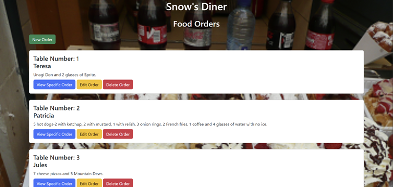
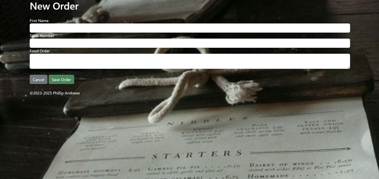
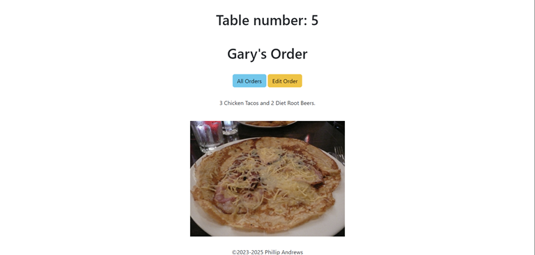
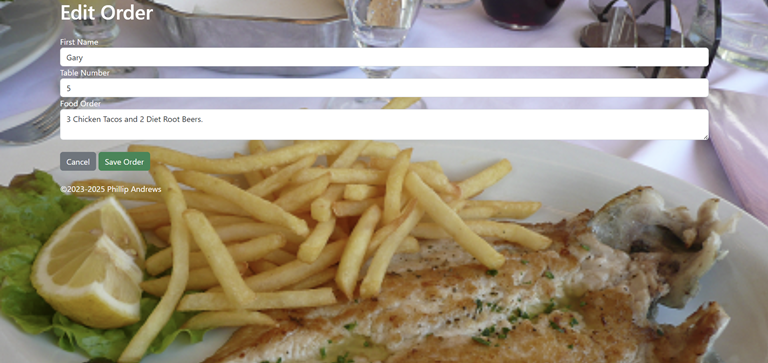

# restaurant_rest_api_website

I created this restaurant order app to learn how to write a REST API. The app is designed to be used by waitstaff and chefs. 
The purpose of this project is to learn how to do full stack development using MongoDB and Node.js with npm, Express, and EJS.   Recently, I added Docker to the program to package all of the dependencies needed to run the application outside of my local machine.

I chose to design the app to take in a typewritten response, rather than buttons, because it allows for complete customization. It also speeds up the input of the order because the waitstaff doesn't have to search for the appropriate buttons.

This is a proof of concept project for a fictitious restaurant called Snow's Diner.  

###### Screenshot of the "restaurant_rest_api_website" all orders section
---

###### Screenshot of the "restaurant_rest_api_website" new order section
---

###### Screenshot of the "restaurant_rest_api_website" show order section for a specific order. (The image of the food does not change and is not intended to represent the actual order).
---

###### Screenshot of the "restaurant_rest_api_website" edit order section

## Author

- [@Phil94comp](https://www.github.com/Phil94comp)

## Technologies Used

* Node.js
* Express
* EJS
* MongoDB
* Bootstrap 5
* Docker
* HTML 5
* Visual Studio Code

## Features

- Users can view all of the orders at once.
- Users can add a new order which is then added to the database.
- Users can click on a specific order to view only that order.
- Users can edit a specific order if the customer changes their order.
- Users can delete an order once the order is fullfilled.
