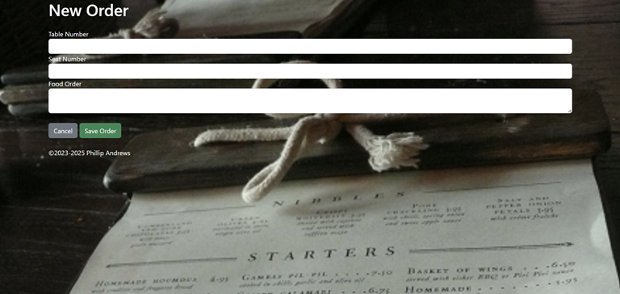
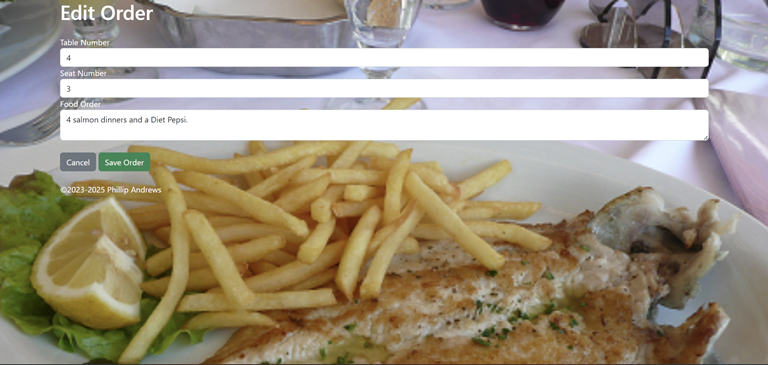

# restaurant_rest_api_website

I created this restaurant order app to learn how to write a REST API. Currently, the app is designed to be used by waitstaff and chefs. However, this project needs additional functionality to include customer usage. 
The purpose of this project is to learn how to do full stack development using MongoDB, Node.js using npm, Express, and EJS.   Recently, I added Docker to the program to help package all of the dependencies needed to help run the application outside of my local machine.  
Functionality I want to add:

  - billing system
  - clickable images of the menu item with the ability to customize orders 
  - user name and password 
  - cart for the items ordered

###### Screenshot of the "restaurant_rest_api_website" all orders section
---

###### Screenshot of the "restaurant_rest_api_website" new order section
---

###### Screenshot of the "restaurant_rest_api_website" show order section of a specific order
---

###### Screenshot of the "restaurant_rest_api_website" edit order section

## Author

- [@Phil94comp](https://www.github.com/Phil94comp)

## Technologies Used

* Express
* Visual Studio Code
* HTML5
* EJS
* MongoDB
* Docker

## Features

- Users can view all of the orders at once
- Users can add a new order and have that order added to the database
- Users can click on a specific order to view only that order
- Users can edit a specific order if the customer changed their order
- Users can delete an order once the order is fullfilled
